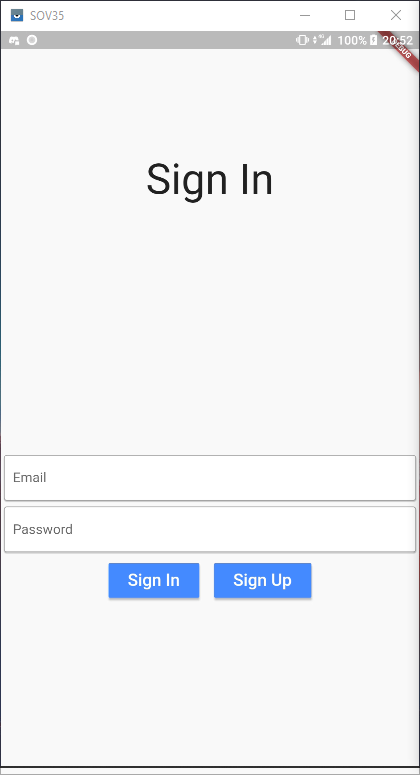
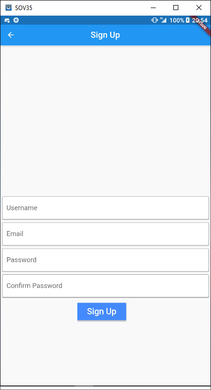
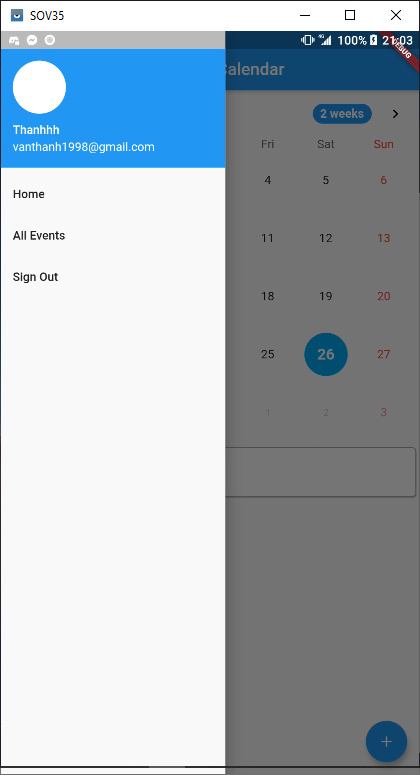
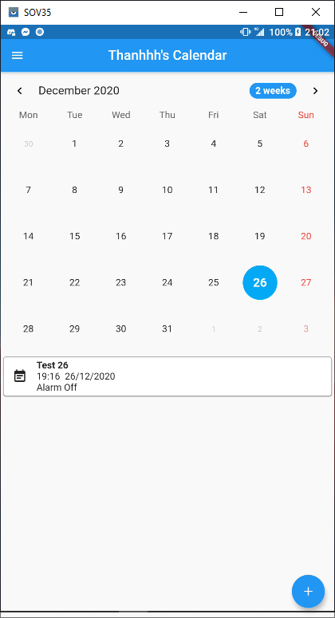
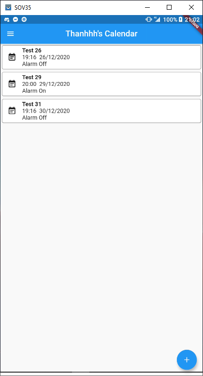
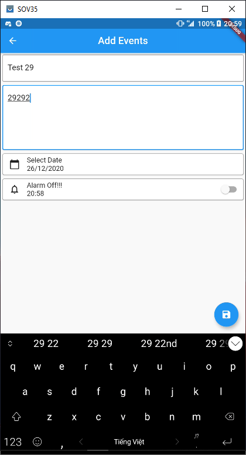
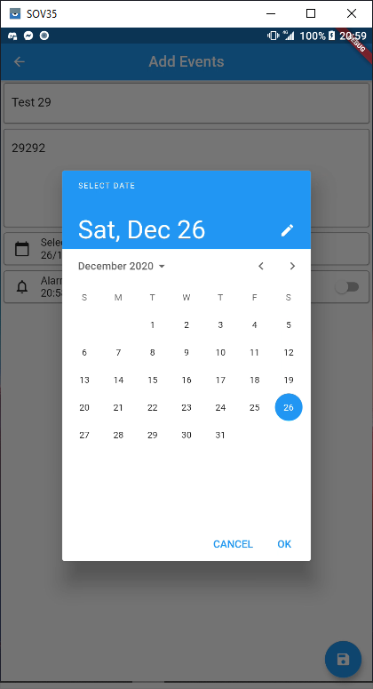
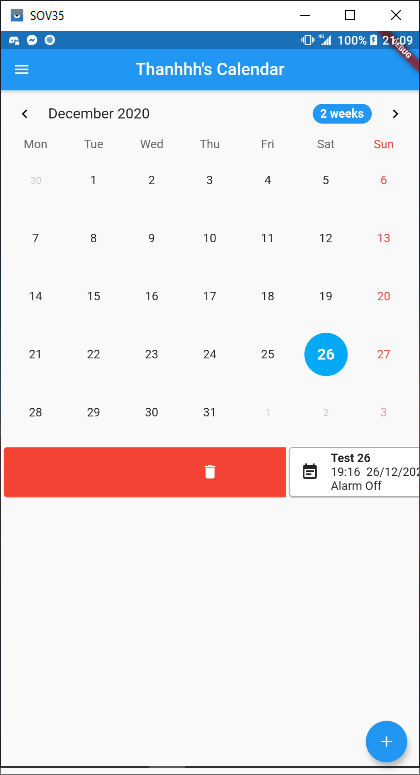
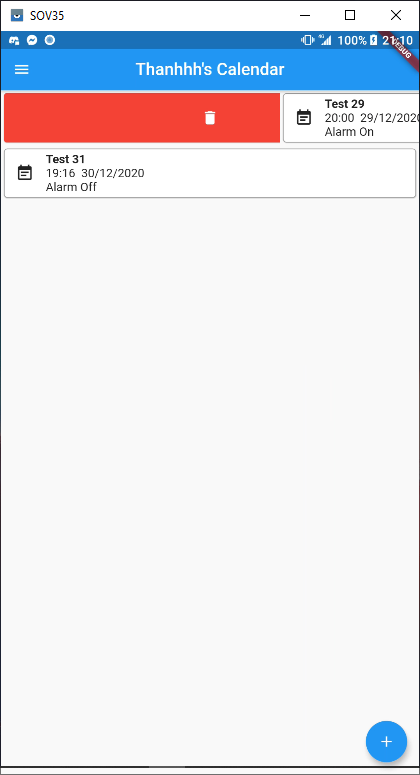
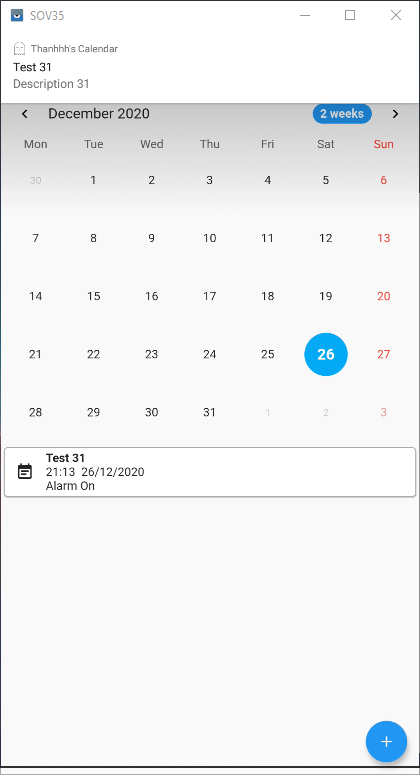

# Calendar App

A Calendar App made with flutter
Save data on Cloud Firestore and Auth with Firebase Auth
User can:
- SignIn, SignUp, SignOut
- View calendar table
- View, Add, Edit, Delete events
- Set notification to events
# Getting Started

## SignIn, SignUp, SignOut
### SignIn

### SignUp

### Drawer and SignOut

## Home, All Events
### HomePage

### All

## Add, Edit

## Delete

## Notification

